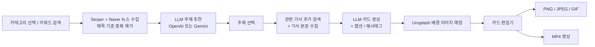

# card-news

<p>
  
  
  
  
  
  
  
</p>

**card-news**(카드뉴스 제조기)는 AI·기술·주식·경제·국제·사회·과학 뉴스를 수집하고, LLM이 주제를 추천하고 기사를 교차 검증해 **카드뉴스 슬라이드를 자동으로 만들어 주는 Electron 데스크톱 앱**입니다. 만들어진 카드는 앱 안에서 직접 편집하고 PNG/JPEG/GIF 이미지나 MP4 영상으로 내보낼 수 있습니다.

## 동작 흐름



## 주요 기능

- **뉴스 수집**: 카테고리(AI, 기술, 주식, 경제, 국제, 사회, 과학) 또는 자유 키워드로 Serper(Google News)와 Naver 뉴스를 병렬 검색하고 제목 기준으로 중복을 제거합니다.
- **LLM 주제 추천**: 수집한 기사를 분석해 관심도 점수가 붙은 주제를 제안합니다. 프로바이더는 OpenAI(`gpt-4o-mini`)와 Gemini(`gemini-2.5-flash`) 중 설정에서 선택합니다.
- **카드 자동 생성**: 선택한 주제의 관련 기사를 추가 검색하고 본문을 수집한 뒤, 슬라이드별 키워드/제목/설명/출처/해시태그와 인스타그램용 캡션을 생성합니다. 마지막에 프로필 소개 카드가 자동으로 붙습니다.
- **배경 이미지**: Unsplash 자동 매칭, Google 이미지 검색, 로컬 이미지 업로드를 지원합니다.
- **카드 편집기**: 이미지 배경형 / 상하 분할형 두 가지 레이아웃, 텍스트 위치·폰트 크기 조정, 자유 텍스트 블록, 라이트/다크 테마.
- **이미지 내보내기**: 현재 카드 PNG 저장, 전체 카드 일괄 저장(`output/YYYY-MM-DD/card-news-HHmmss/`), GIF 배경 카드는 GIF로 내보냅니다.
- **카드영상만들기**(플로팅 창, ffmpeg 사용): 슬라이드쇼 / 원본 영상 변환 / 영상 + 텍스트 오버레이 / YouTube 자막 추출·한국어 번역·번인 4가지 모드. BGM 선택, 영상 다운로드(`youtube-dl-exec`)를 지원합니다.
- **프로젝트 저장**: Supabase를 설정하면 카드 프로젝트, 뉴스 검색 기록, API 키를 클라우드에 저장합니다. 설정하지 않으면 클라우드 기능만 비활성화됩니다.
- **로컬 잠금**: 앱 실행 시 관리자 비밀번호 로그인 화면이 표시됩니다.

## 빠른 시작

요구 사항: Node.js, npm (Windows 기준으로 개발됨)

```bash
git clone https://github.com/junghun133/card-news.git
cd card-news
npm install
cp .env.example .env   # Supabase를 쓸 때만 필요
npm run dev
```

| 스크립트 | 설명 |
|---------|------|
| `npm run dev` | 개발 모드 실행 (`electron-vite dev`, `chcp 65001`을 호출하므로 Windows 전용) |
| `npm run build` | 프로덕션 빌드 (`electron-vite build`) |
| `npm run preview` | 빌드 결과 미리보기 |

### 1. API 키 입력

뉴스 수집과 카드 생성에 필요한 API 키는 앱 실행 후 **설정** 페이지에서 입력합니다. 값은 로컬 `electron-store`에 저장되고, Supabase를 설정했다면 클라우드와 동기화됩니다.

### 2. Supabase (선택)

1. Supabase 프로젝트를 만들고 SQL Editor에서 `supabase-schema.sql`을 실행합니다. (`api_keys`, `card_news_projects`, `news_searches` 테이블 생성)
2. `.env`에 `VITE_SUPABASE_URL`, `VITE_SUPABASE_ANON_KEY`를 채웁니다.

> 스키마의 RLS 정책은 anon 키에 전체 접근을 허용하는 단일 사용자용 구성입니다. 공개 환경에서는 정책을 강화하세요.
> 현재 `supabase-schema.sql`의 `api_keys` 테이블에는 앱 코드가 조회하는 `naver_client_id`, `naver_client_secret`, `gemini_api_key`, `llm_provider` 컬럼이 없습니다. 해당 키를 클라우드 동기화하려면 컬럼을 추가해야 합니다.

### 3. 관리자 비밀번호

기본 비밀번호는 `admin`입니다. 첫 실행 후 **설정** 페이지에서 변경하세요.

## 환경 변수

`.env`는 Vite가 렌더러에서 읽습니다. 소스 코드에서 `.env`로 읽는 값은 `VITE_SUPABASE_*` 두 개뿐이며, 나머지 키는 앱 설정 화면에서 입력합니다.

| 이름 | 용도 | 필수 |
|------|------|------|
| `VITE_SUPABASE_URL` | Supabase 프로젝트 URL | 선택 (클라우드 저장용) |
| `VITE_SUPABASE_ANON_KEY` | Supabase anon public 키 | 선택 (클라우드 저장용) |
| `OPENAI_API_KEY` | OpenAI 키 (`.env.example`에 있으나 앱은 설정 화면 값을 사용) | 설정 화면에서 입력 |
| `SERPER_API_KEY` | Serper 뉴스/이미지/영상 검색 (`.env.example`에 있으나 앱은 설정 화면 값을 사용) | 설정 화면에서 입력 |
| `UNSPLASH_ACCESS_KEY` | Unsplash 이미지 검색 | 설정 화면에서 입력 |

설정 화면에는 위 키 외에 Naver 검색 API(Client ID/Secret)와 Gemini API 키, LLM 프로바이더 선택이 있습니다. Naver 키가 없으면 해당 소스 결과는 제외됩니다.

## 기술 스택

| 영역 | 사용 기술 |
|------|-----------|
| 데스크톱 | Electron, electron-vite, electron-store |
| UI | React 19, React Router, Zustand, Tailwind CSS 4, TypeScript |
| AI | OpenAI SDK, `@google/generative-ai` |
| 데이터 수집 | Serper, Naver 검색 API, Unsplash |
| 미디어 | html-to-image, gifenc / gifuct-js, ffmpeg-static + fluent-ffmpeg, youtube-dl-exec |
| 클라우드 | Supabase (`@supabase/supabase-js`) |

## 프로젝트 구조

```
card-news/
├── src/
│   ├── main/            # Electron 메인 프로세스
│   │   ├── ipc/         # news, export, video, settings IPC 핸들러
│   │   └── services/    # LLM(openai/gemini), serper, naver, unsplash, ffmpeg, 영상 다운로드
│   ├── preload/         # contextBridge API
│   └── renderer/src/    # React 앱 (pages, components, stores, lib)
├── scripts/             # generate-icon.mjs (앱 아이콘 생성)
├── resources/           # 앱 아이콘
├── supabase-schema.sql
└── .env.example
```

## 라이선스

`package.json`에 `ISC`로 명시되어 있으며, 별도의 `LICENSE` 파일은 없습니다.
